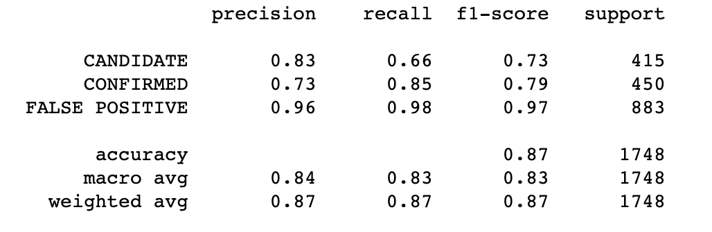

# Machine Learning Homework - Exoplanet Exploration

This repository contains two Jupyter notebooks. Click the links below to view or download them.

[SVC Model](model_1.ipynb)

[Random Forest Classifier](random_forest.ipynb)
## Background
Over a period of nine years in deep space, the NASA Kepler space telescope has been out on a planet-hunting mission to discover hidden planets outside of our solar system.
To help process this data, you will create machine learning models capable of classifying candidate exoplanets from the raw dataset.
## Instructions
In this homework assignment, you I need to:

### Preprocess the Data

* Preprocess the dataset prior to fitting the model.
* Perform feature selection and remove unnecessary features.
* Use `MinMaxScaler` to scale the numerical data.
* Separate the data into training and testing data.

### Tune Model Parameters

* Use `GridSearch` to tune model parameters.
* Tune and compare at least two different classifiers.

### Report:

### Random Forest:

Testing Data Score: 89%

With Hyperparameter Tuning: 

Best Score: 0.8817488847975898

Training score: 0.5943162311653634

Testing score: 0.6006864988558352

Top Important Features: 

 (0.11292541388960561, 'koi_fpflag_co'),
 (0.09546624971279441, 'koi_fpflag_nt'),
 (0.058408343967751096, 'koi_model_snr'),
 (0.05732861577426242, 'koi_fpflag_ss'),
 (0.04992822122249595, 'koi_prad'),
 (0.03953142197580586, 'koi_prad_err2'),
 (0.03686228779771059, 'koi_fpflag_ec'),
 (0.03511685768660821, 'koi_duration_err2')
 
### Support Vector Machine:

Best Score: 0.863438643855653

Training Data Score: 0.7383177570093458

Testing Data Score: 0.7391304347826086

### SVC Classification Report

